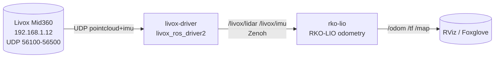

# Livox Mid360 + RKO-LIO — ROS2 Docker (Jazzy / Kilted / Lyrical) · Zenoh

<p align="center">
  
</p>

[](https://sattwik-sahu.github.io/livox-mid360_rko-lio_ros2/)
[](https://docs.ros.org)
[](https://docs.ros.org/en/kilted/Installation/RMW-Implementations/Non-DDS-Implementations/Working-with-Zenoh.html)
[](LICENSE)

### Build status (per ROS2 distro)

| Distro | CI | Base | Status |
|--------|----|------|--------|
| **jazzy** | [](https://github.com/sattwik-sahu/livox-mid360_rko-lio_ros2/actions/workflows/ci.yml) | `ros:jazzy-ros-base` (Noble) | ✅ |
| **kilted** | [](https://github.com/sattwik-sahu/livox-mid360_rko-lio_ros2/actions/workflows/ci.yml) | `ros:kilted-ros-base` (Noble) | ✅ |
| **lyrical** | [](https://github.com/sattwik-sahu/livox-mid360_rko-lio_ros2/actions/workflows/ci.yml) | `ros:lyrical-ros-base` (Resolute) | 🚧  |

> **Note:** CI is a single `ci.yml` matrix (`linux/amd64,arm64` via QEMU). Badges above share the same workflow status but are shown per-distro for clarity. `lyrical` is allowed to be experimental until the vendor `cmake_minimum_required` bump is upstreamed.

| Image | `jazzy` | `kilted` | `lyrical` |
|-------|---------|----------|-----------|
| `livox-driver` | [](https://github.com/sattwik-sahu/livox-mid360_rko-lio_ros2/pkgs/container/livox-mid360_rko-lio_ros2%2Flivox-driver) | [](https://github.com/sattwik-sahu/livox-mid360_rko-lio_ros2/pkgs/container/livox-mid360_rko-lio_ros2%2Flivox-driver) | [](https://github.com/sattwik-sahu/livox-mid360_rko-lio_ros2/pkgs/container/livox-mid360_rko-lio_ros2%2Flivox-driver) |
| `rko-lio` | [](https://github.com/sattwik-sahu/livox-mid360_rko-lio_ros2/pkgs/container/livox-mid360_rko-lio_ros2%2Frko-lio) | [](https://github.com/sattwik-sahu/livox-mid360_rko-lio_ros2/pkgs/container/livox-mid360_rko-lio_ros2%2Frko-lio) | [](https://github.com/sattwik-sahu/livox-mid360_rko-lio_ros2/pkgs/container/livox-mid360_rko-lio_ros2%2Frko-lio) |

> **Builds:** All tags are multi-arch (`linux/amd64`, `linux/arm64`). Status of each `jazzy`/`kilted`/`lyrical` build is tracked by the **CI** workflow badge above (matrix: 6 image × distro jobs). Use the **Setup Wizard** below to pull the right tag.

> **Documentation site:** **[https://sattwik-sahu.github.io/livox-mid360_rko-lio_ros2/](https://sattwik-sahu.github.io/livox-mid360_rko-lio_ros2/)** — includes an **interactive [Setup Wizard](https://sattwik-sahu.github.io/livox-mid360_rko-lio_ros2/setup-wizard/)** (pick OS / Arch / ROS distro → commands auto-update).

Two-container ROS 2 stack for the **Livox Mid360** 3D lidar:

| Container | Image | What it runs |
|-----------|-------|--------------|
| `livox-driver` | `ghcr.io/sattwik-sahu/livox-mid360_rko-lio_ros2/livox-driver:{distro}` | `livox_ros_driver2` SDK2 + ROS2 driver (publishes `/livox/lidar`, `/livox/imu`) |
| `rko-lio` | `ghcr.io/sattwik-sahu/livox-mid360_rko-lio_ros2/rko-lio:{distro}` | `PRBonn/rko_lio` LiDAR-inertial odometry (subscribes to driver topics, publishes `/odom`, `/tf`, map) |

> **Zenoh:** A Zenoh router is expected to be running **outside** this compose (your `pixi` project). The containers only set `RMW_IMPLEMENTATION=rmw_zenoh_cpp` and connect to it — no extra Docker setup.

All images are **multi-arch** (`linux/amd64`, `linux/arm64`) — build on Linux, `docker pull` on Mac Mini `osx-arm64` works transparently.

---

## Quick start

```bash
git clone https://github.com/sattwik-sahu/livox-mid360_rko-lio_ros2.git
cd livox-mid360_rko-lio_ros2
cp .env.example .env        # edit HOST_IP / LIDAR_IP / ROS_DISTRO
# 1) Host network (LiDAR is static IP only)
sudo ./scripts/setup_host_network.sh eth0 192.168.1.5 192.168.1.12
# 2) Start Zenoh router separately (your pixi project), e.g.:
#    pixi run zenoh-router  # or: ros2 run rmw_zenoh_cpp rmw_zenohd
# 3) Start driver + RKO-LIO
docker compose up -d
docker compose logs -f
# 4) Verify
docker compose exec livox-driver ros2 topic list | grep livox
docker compose exec rko-lio ros2 topic list | grep odom
```

Works on both Linux and Mac Mini (`osx-arm64`) with `network_mode: host`.

> **Wizard:** pick your OS / Arch / ROS distro at **[Setup Wizard](https://sattwik-sahu.github.io/livox-mid360_rko-lio_ros2/setup-wizard/)** — commands update live.

---

## Switching ROS2 distro

```bash
ROS_DISTRO=kilted docker compose build   # or lyrical / jazzy
ROS_DISTRO=kilted docker compose up -d
# Prebuilt GHCR (no build needed):
docker compose pull   # respects ROS_DISTRO from .env
```

| Distro | Base image | Ubuntu | Status |
|--------|------------|--------|--------|
| `jazzy` (LTS, default) | `ros:jazzy-ros-base` | 24.04 Noble | ✅ `ros-jazzy-rko-lio` + `rmw_zenoh` available |
| `kilted` | `ros:kilted-ros-base` | 24.04 Noble | ✅ `ros-kilted-rko-lio` + `rmw_zenoh` |
| `lyrical` | `ros:lyrical-ros-base` | Resolute | ✅ via source fallback if binary not yet published |

---

## How it works



- **Zenoh RMW**: Containers set `RMW_IMPLEMENTATION=rmw_zenoh_cpp` and connect to an **external** Zenoh router (your `pixi` project). No router is started by compose.
- **Host networking**: Livox SDK2 opens server sockets on `host_net_info` ports; those must be reachable on the host subnet. Hence `network_mode: host` (now works on both Linux and macOS).
- **Multi-arch**: `docker buildx` with `linux/amd64,linux/arm64` → single manifest in GHCR (`docker pull` selects arch). Build locally: `docker buildx build --platform linux/amd64,linux/arm64 -f docker/livox.Dockerfile --build-arg ROS_DISTRO=jazzy -t ghcr.io/sattwik-sahu/livox-mid360_rko-lio_ros2/livox-driver:jazzy .`

---

## Configuration

| File | Edit this when… |
|------|-----------------|
| `.env` | change `ROS_DISTRO`, `HOST_IP`, `LIDAR_IP`, `ROS_DOMAIN_ID` |
| `config/livox/MID360_config.json` | set `pcl_data_type` (1=32-bit Cartesian, 2=16-bit, 3=spherical), `pattern_mode` (0 non-repeating / 1 repeating), `extrinsic_parameter` (mount pose) |
| `config/rko_lio/params.yaml` | voxel size, map range, topic remaps for RKO-LIO |
| `src/livox_ros/launch_ROS2/msg_MID360_launch.py` | `xfer_format` (0 PointCloud2 / 1 CustomMsg), `publish_freq`, `frame_id` |

Full option reference: **[docs/configuration.md](https://sattwik-sahu.github.io/livox-mid360_rko-lio_ros2/configuration/)** and **[docs/tutorial.md](https://sattwik-sahu.github.io/livox-mid360_rko-lio_ros2/tutorial/)**.

---

## Documentation

**Site:** [https://sattwik-sahu.github.io/livox-mid360_rko-lio_ros2/](https://sattwik-sahu.github.io/livox-mid360_rko-lio_ros2/)  •  **Layout:** `docker/` (images), `config/livox/` & `config/rko_lio/` (configs), `scripts/` (helpers), `ws/src/` (ROS sources if used), `docs/` (Jekyll)

```
repo/                         # docker-compose.yml at root (Docker convention)
├─ docker/                    # Dockerfiles + entrypoints
├─ config/
│   ├─ livox/MID360_config.json
│   └─ rko_lio/params.yaml
├─ scripts/                   # setup_host_network.sh, check_zenoh.sh
├─ src/ & sdk/                # ROS sources + vendor SDK (or ws/src/ layout)
└─ docs/                      # Jekyll site
```

See “Dir tree” in docs for rationale.

| Page | Link |
|------|------|
| **Setup Wizard** (interactive OS/Arch/Distro → commands) | [setup-wizard](https://sattwik-sahu.github.io/livox-mid360_rko-lio_ros2/setup-wizard/) |
| Quick Start | [quickstart](https://sattwik-sahu.github.io/livox-mid360_rko-lio_ros2/quickstart/) |
| Full Tutorial (networking, Zenoh, tuning) | [tutorial](https://sattwik-sahu.github.io/livox-mid360_rko-lio_ros2/tutorial/) |
| Configuration reference | [configuration](https://sattwik-sahu.github.io/livox-mid360_rko-lio_ros2/configuration/) |
| References | [references](https://sattwik-sahu.github.io/livox-mid360_rko-lio_ros2/references/) |

Local docs: `cd docs && bundle install && bundle exec jekyll serve` → http://localhost:4000/livox-mid360_rko-lio_ros2/  
Pages build: `.github/workflows/docs.yml` → GitHub Pages (workflow `deploy` env `github-pages`).

---

## GHCR images

```bash
# Pull without building
docker pull ghcr.io/sattwik-sahu/livox-mid360_rko-lio_ros2/livox-driver:jazzy
docker pull ghcr.io/sattwik-sahu/livox-mid360_rko-lio_ros2/rko-lio:jazzy
# Other distros
docker pull ghcr.io/sattwik-sahu/livox-mid360_rko-lio_ros2/livox-driver:kilted
docker pull ghcr.io/sattwik-sahu/livox-mid360_rko-lio_ros2/livox-driver:lyrical
```

Images are published by `.github/workflows/ci.yml` on every push to `main` and on version tags.

---

## Troubleshooting

- `No data / ping fails` → run `sudo ./scripts/setup_host_network.sh eth0 && ping 192.168.1.12`; check `config/livox/MID360_config.json` IPs match `HOST_IP`; allow `56000-56500/udp` in firewall.
- `Nodes not discovering` → ensure your external Zenoh router is running (`pixi run zenoh-router`); verify `RMW_IMPLEMENTATION=rmw_zenoh_cpp` and `ROS_DOMAIN_ID` match across host + containers.

---

## License

MIT — see [LICENSE](LICENSE). Upstream `livox_ros_driver2`, `Livox-SDK2`, and `rko_lio` are MIT, so MIT keeps the stack permissive for commercial/research use. Apache-2.0 is the alternative if you need an explicit patent grant.

## Acknowledgements

- Livox SDK2 / livox_ros_driver2 — Livox Technology
- RKO-LIO — Photogrammetry & Robotics Lab, University of Bonn
- Zenoh RMW — ZettaScale / ROS 2
