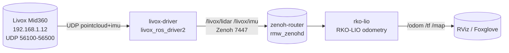

# Livox Mid360 + RKO-LIO — ROS2 Docker (Jazzy / Kilted / Lyrical) · Zenoh

[](https://github.com/sattwik-sahu/livox-mid360_rko-lio_ros2/actions/workflows/ci.yml)
[](https://github.com/sattwik-sahu/livox-mid360_rko-lio_ros2/actions/workflows/docs.yml)
[](https://github.com/sattwik-sahu/livox-mid360_rko-lio_ros2/pkgs/container/livox-mid360_rko-lio_ros2%2Flivox-driver)
[](https://github.com/sattwik-sahu/livox-mid360_rko-lio_ros2/pkgs/container/livox-mid360_rko-lio_ros2%2Frko-lio)
[](https://docs.ros.org)
[](https://docs.ros.org/en/kilted/Installation/RMW-Implementations/Non-DDS-Implementations/Working-with-Zenoh.html)
[](LICENSE)

> **Documentation site:** https://sattwik-sahu.github.io/livox-mid360_rko-lio_ros2/ — includes an **interactive Setup Wizard** (pick OS / Arch / ROS distro → commands auto-update).

Two-container ROS 2 stack for the **Livox Mid360** 3D lidar:

| Container | Image | What it runs |
|-----------|-------|--------------|
| `livox-driver` | `ghcr.io/sattwik-sahu/livox-mid360_rko-lio_ros2/livox-driver:{distro}` | `livox_ros_driver2` SDK2 + ROS2 driver (publishes `/livox/lidar`, `/livox/imu`) |
| `rko-lio` | `ghcr.io/sattwik-sahu/livox-mid360_rko-lio_ros2/rko-lio:{distro}` | `PRBonn/rko_lio` LiDAR-inertial odometry (subscribes to driver topics, publishes `/odom`, `/tf`, map) |
| `zenoh-router` | `ros:{distro}-ros-base` (ephemeral) | `rmw_zenohd` — Zenoh router required for `rmw_zenoh_cpp` discovery |

All images are **multi-arch** (`linux/amd64`, `linux/arm64`) — build on Linux, `docker pull` on Mac Mini `osx-arm64` works transparently.

---

## Quick start (Linux)

```bash
git clone https://github.com/sattwik-sahu/livox-mid360_rko-lio_ros2.git
cd livox-mid360_rko-lio_ros2
cp .env.example .env        # edit HOST_IP / LIDAR_IP / ROS_DISTRO
# 1) Host network (LiDAR is static IP only)
sudo ./scripts/setup_host_network.sh eth0 192.168.1.5 192.168.1.12
# 2) Start everything (Zenoh + driver + RKO-LIO)
docker compose up -d
docker compose logs -f
# 3) Verify
docker compose exec livox-driver ros2 topic list | grep livox
docker compose exec rko-lio ros2 topic list | grep odom
```

**Mac Mini (osx-arm64)**: `docker compose -f docker-compose.yml -f docker-compose.mac.yml up -d` — see [docs/tutorial.md](https://sattwik-sahu.github.io/livox-mid360_rko-lio_ros2/tutorial/) for bridge-mode caveats (Docker Desktop has no `host` networking; OrbStack/Colima recommended).

> **Wizard:** pick your OS / Arch / ROS distro at **[Setup Wizard](https://sattwik-sahu.github.io/livox-mid360_rko-lio_ros2/setup-wizard/)** — commands update live.

---

## Switching ROS2 distro

```bash
ROS_DISTRO=kilted docker compose build   # or lyrical / jazzy
ROS_DISTRO=kilted docker compose up -d
# Prebuilt GHCR (no build needed):
docker compose pull   # respects ROS_DISTRO from .env
```

| Distro | Base image | Ubuntu | Status |
|--------|------------|--------|--------|
| `jazzy` (LTS, default) | `ros:jazzy-ros-base` | 24.04 Noble | ✅ `ros-jazzy-rko-lio` + `rmw_zenoh` available |
| `kilted` | `ros:kilted-ros-base` | 24.04 Noble | ✅ `ros-kilted-rko-lio` + `rmw_zenoh` |
| `lyrical` | `ros:lyrical-ros-base` | Resolute | ✅ via source fallback if binary not yet published |

---

## How it works



- **Zenoh RMW**: `RMW_IMPLEMENTATION=rmw_zenoh_cpp` on every container + router sidecar. Without the router nodes cannot discover each other (multicast disabled in node session config). Config at `docker/zenoh-config.json5`.
- **Host networking**: Livox SDK2 opens server sockets on `host_net_info` ports; those must be reachable on the host subnet. Hence `network_mode: host` on Linux. See [docs/configuration.md](https://sattwik-sahu.github.io/livox-mid360_rko-lio_ros2/configuration/) for tuning.
- **Multi-arch**: `docker buildx` with `linux/amd64,linux/arm64` → single manifest in GHCR (`docker pull` selects arch). Build locally: `docker buildx build --platform linux/amd64,linux/arm64 -f Dockerfile.livox --build-arg ROS_DISTRO=jazzy -t ghcr.io/sattwik-sahu/livox-mid360_rko-lio_ros2/livox-driver:jazzy .`

---

## Configuration

| File | Edit this when… |
|------|-----------------|
| `.env` | change `ROS_DISTRO`, `HOST_IP`, `LIDAR_IP`, `ROS_DOMAIN_ID` |
| `config/MID360_config.json` | set `pcl_data_type` (1=32-bit Cartesian, 2=16-bit, 3=spherical), `pattern_mode` (0 non-repeating / 1 repeating), `extrinsic_parameter` (mount pose) |
| `config/rko_lio_params.yaml` | voxel size, map range, topic remaps for RKO-LIO |
| `src/livox_ros/launch_ROS2/msg_MID360_launch.py` | `xfer_format` (0 PointCloud2 / 1 CustomMsg), `publish_freq`, `frame_id` |
| `docker/zenoh-config.json5` | Zenoh scouting / listen endpoints |

Full option reference: **[docs/configuration.md](https://sattwik-sahu.github.io/livox-mid360_rko-lio_ros2/configuration/)** and **[docs/tutorial.md](https://sattwik-sahu.github.io/livox-mid360_rko-lio_ros2/tutorial/)**.

---

## Documentation

| Page | Link |
|------|------|
| **Setup Wizard** (interactive OS/Arch/Distro → commands) | [setup-wizard](https://sattwik-sahu.github.io/livox-mid360_rko-lio_ros2/setup-wizard/) |
| Quick Start | [quickstart](https://sattwik-sahu.github.io/livox-mid360_rko-lio_ros2/quickstart/) |
| Full Tutorial (networking, Zenoh, tuning) | [tutorial](https://sattwik-sahu.github.io/livox-mid360_rko-lio_ros2/tutorial/) |
| Configuration reference | [configuration](https://sattwik-sahu.github.io/livox-mid360_rko-lio_ros2/configuration/) |
| References | [references](https://sattwik-sahu.github.io/livox-mid360_rko-lio_ros2/references/) |

Local docs: `bundle install && bundle exec jekyll serve` inside `docs/` → http://localhost:4000/livox-mid360_rko-lio_ros2/

---

## GHCR images

```bash
# Pull without building
docker pull ghcr.io/sattwik-sahu/livox-mid360_rko-lio_ros2/livox-driver:jazzy
docker pull ghcr.io/sattwik-sahu/livox-mid360_rko-lio_ros2/rko-lio:jazzy
# Other distros
docker pull ghcr.io/sattwik-sahu/livox-mid360_rko-lio_ros2/livox-driver:kilted
docker pull ghcr.io/sattwik-sahu/livox-mid360_rko-lio_ros2/livox-driver:lyrical
```

Images are published by `.github/workflows/ci.yml` on every push to `main` and on version tags.

---

## Troubleshooting

- `No data / ping fails` → run `sudo ./scripts/setup_host_network.sh eth0 && ping 192.168.1.12`; check `config/MID360_config.json` IPs match `HOST_IP`; allow `56000-56500/udp` in firewall.
- `Nodes not discovering` → ensure `zenoh-router` is healthy: `docker compose logs zenoh-router`; verify `RMW_IMPLEMENTATION=rmw_zenoh_cpp` everywhere and `ROS_DOMAIN_ID` matches.
- `macOS no host network` → use `docker-compose.mac.yml` overlay or switch to OrbStack/Colima.

---

## License

MIT — see [LICENSE](LICENSE). Upstream `livox_ros_driver2`, `Livox-SDK2`, and `rko_lio` are MIT, so MIT keeps the stack permissive for commercial/research use. Apache-2.0 is the alternative if you need an explicit patent grant.

## Acknowledgements

- Livox SDK2 / livox_ros_driver2 — Livox Technology
- RKO-LIO — Photogrammetry & Robotics Lab, University of Bonn
- Zenoh RMW — ZettaScale / ROS 2
