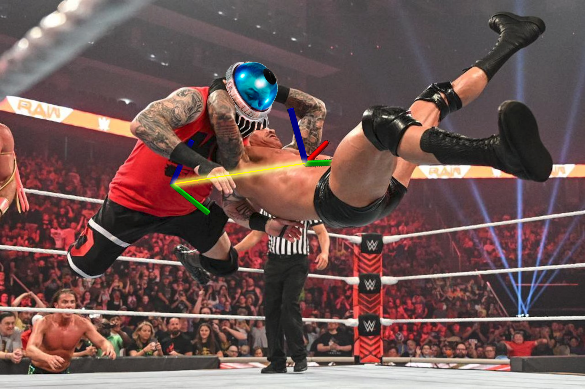
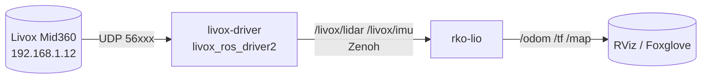

# Livox Mid360 + RKO-LIO on ROS 2

{: .fs-6 .fw-300 }

Dockerized autonomy stack for the **Livox Mid360** — driver + LiDAR-inertial odometry — on **ROS 2 Jazzy / Kilted / Lyrical** with **Zenoh** RMW. Multi-arch (`amd64` + `arm64`) via GHCR. Build on Linux, pull on Mac Mini `osx-arm64`.

[](https://github.com/sattwik-sahu/livox-mid360_rko-lio_ros2/actions/workflows/ci.yml)
[](https://sattwik-sahu.github.io/livox-mid360_rko-lio_ros2/)
[](https://github.com/sattwik-sahu/livox-mid360_rko-lio_ros2/pkgs/container/livox-mid360_rko-lio_ros2%2Flivox-driver)
[](https://github.com/sattwik-sahu/livox-mid360_rko-lio_ros2/pkgs/container/livox-mid360_rko-lio_ros2%2Flivox-driver)
[](https://github.com/sattwik-sahu/livox-mid360_rko-lio_ros2/pkgs/container/livox-mid360_rko-lio_ros2%2Flivox-driver)
[](https://github.com/sattwik-sahu/livox-mid360_rko-lio_ros2/pkgs/container/livox-mid360_rko-lio_ros2%2Frko-lio)
[](https://github.com/sattwik-sahu/livox-mid360_rko-lio_ros2/pkgs/container/livox-mid360_rko-lio_ros2%2Frko-lio)
[](https://github.com/sattwik-sahu/livox-mid360_rko-lio_ros2/pkgs/container/livox-mid360_rko-lio_ros2%2Frko-lio)

{: .important }
> **New here?** Use the interactive [**Setup Wizard →**](setup-wizard/) to pick your **OS / Arch / ROS 2 distro** and get copy-paste commands. Then follow the [Quick Start](quickstart/) (5 min) or [Tutorial](tutorial/) (full).

## At a glance



| Service | Image | Publishes / Subscribes |
|---------|-------|------------------------|
| `livox-driver` | `ghcr.io/sattwik-sahu/livox-mid360_rko-lio_ros2/livox-driver:{distro}` | `/livox/lidar` (`PointCloud2` or `CustomMsg`), `/livox/imu` |
| `rko-lio` | `ghcr.io/sattwik-sahu/livox-mid360_rko-lio_ros2/rko-lio:{distro}` | subscribes lidar+imu, publishes `/odom`, `/tf` |

> **Zenoh:** An external Zenoh router (your `pixi` project) is expected — e.g. `pixi run zenoh-router`. Containers just set `RMW_IMPLEMENTATION=rmw_zenoh_cpp`.

## Choose your path

| I want to… | Go to |
|------------|-------|
| Get running in 5 minutes | [Quick Start](quickstart/) |
| Generate exact commands for my machine | [**Setup Wizard**](setup-wizard/) |
| Understand networking, Zenoh, every config knob | [Tutorial](tutorial/) + [Configuration](configuration/) |
| Look up datasheets & protocol docs | [References](references/) |

## Supported matrix

| ROS 2 | Ubuntu | GHCR tag | CI status |
|-------|--------|----------|-----------|
| `jazzy` (LTS, default) | 24.04 Noble | `livox-driver:jazzy` / `rko-lio:jazzy` | [](https://github.com/sattwik-sahu/livox-mid360_rko-lio_ros2/actions/workflows/ci.yml) |
| `kilted` | 24.04 Noble | `livox-driver:kilted` / `rko-lio:kilted` | same workflow — matrix job `kilted` |
| `lyrical` | Resolute | `livox-driver:lyrical` / `rko-lio:lyrical` | same workflow — matrix job `lyrical` |

All images: `linux/amd64` + `linux/arm64`. See **CI** matrix (6 jobs: `livox-driver` × `jazzy`/`kilted`/`lyrical` + `rko-lio` × `jazzy`/`kilted`/`lyrical`).

Pull examples:

```bash
docker pull ghcr.io/sattwik-sahu/livox-mid360_rko-lio_ros2/livox-driver:jazzy
docker pull ghcr.io/sattwik-sahu/livox-mid360_rko-lio_ros2/rko-lio:kilted
docker pull ghcr.io/sattwik-sahu/livox-mid360_rko-lio_ros2/livox-driver:lyrical
```
