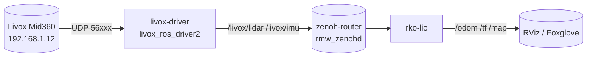

# Livox Mid360 + RKO-LIO on ROS 2

{: .fs-6 .fw-300 }

Dockerized autonomy stack for the **Livox Mid360** — driver + LiDAR-inertial odometry — on **ROS 2 Jazzy / Kilted / Lyrical** with **Zenoh** RMW. Multi-arch (`amd64` + `arm64`) via GHCR. Build on Linux, pull on Mac Mini `osx-arm64`.

{: .important }
> **New here?** Use the interactive [**Setup Wizard →**](setup-wizard/) to pick your **OS / Arch / ROS 2 distro** and get copy-paste commands. Then follow the [Quick Start](quickstart/) (5 min) or [Tutorial](tutorial/) (full).

## At a glance

| Service | Image | Publishes / Subscribes |
|---------|-------|------------------------|
| `zenoh-router` | `ros:{distro}-ros-base` | `rmw_zenohd` on `tcp/7447` |
| `livox-driver` | `ghcr.io/sattwik-sahu/livox-mid360_rko-lio_ros2/livox-driver:{distro}` | `/livox/lidar` (`PointCloud2` or `CustomMsg`), `/livox/imu` |
| `rko-lio` | `ghcr.io/sattwik-sahu/livox-mid360_rko-lio_ros2/rko-lio:{distro}` | subscribes lidar+imu, publishes `/odom`, `/tf` |

## Choose your path

| I want to… | Go to |
|------------|-------|
| Get running in 5 minutes | [Quick Start](quickstart/) |
| Generate exact commands for my machine | [**Setup Wizard**](setup-wizard/) |
| Understand networking, Zenoh, every config knob | [Tutorial](tutorial/) + [Configuration](configuration/) |
| Look up datasheets & protocol docs | [References](references/) |

## Supported matrix

| ROS 2 | Ubuntu | GHCR tag | `ros-{distro}-rko-lio` |
|-------|--------|----------|------------------------|
| `jazzy` (LTS, default) | 24.04 Noble | `:jazzy` | ✅ binary |
| `kilted` | 24.04 Noble | `:kilted` | ✅ binary |
| `lyrical` | Resolute | `:lyrical` | ✅ binary or source fallback |

All images: `linux/amd64` + `linux/arm64`.
